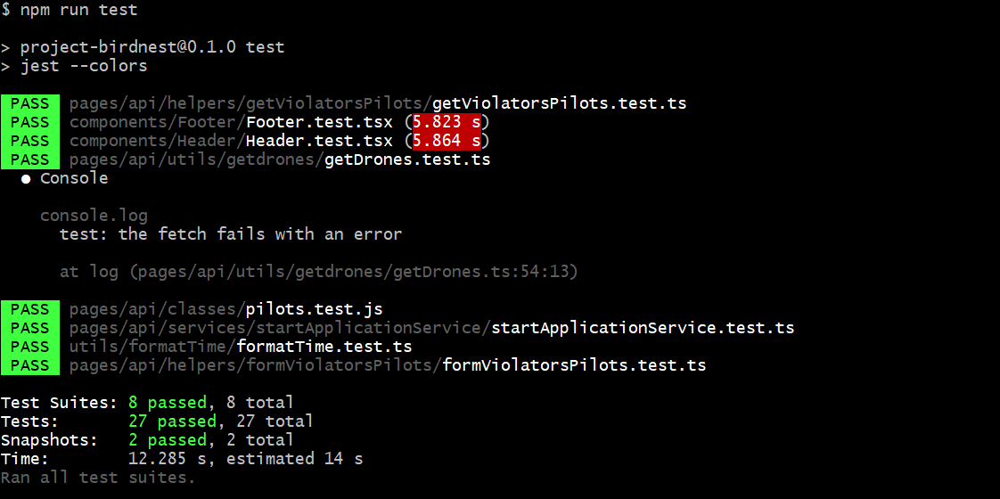
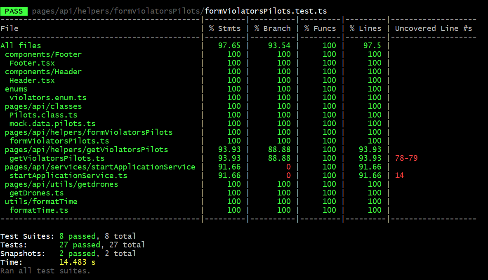
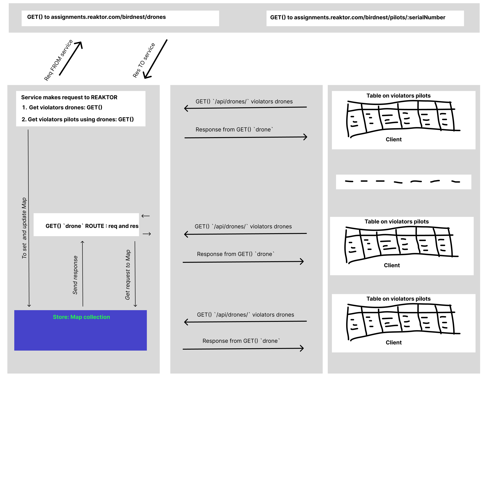
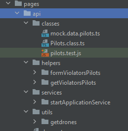

# Table of content  

[Getting Started](#getting_started)  
- [Introduction](#introduction)
- [Objective](#objective)  

[Sprints](#sprints)  
[How to start](#how_to_start)  
[Tests](#tests)  
[GitHub actions](#github_actions)  
[How it works](#how_it_works)  
- [Description](#description)  
- [Scheme client-server](#scheme_client_server)  
- [Structure of project](#structure_of_project)  

[In conclusion](#in_conclusion)  
[Thank you!](#thank_you)  


# <a name="getting_started">Getting Started</a>

## <a name="introduction">Introduction</a>

This is "Project Birdnest", that is made to monitor no drone zone (NDZ). 

To build and deploy a web application which lists all the pilots who recently violated the NDZ perimeter.

## <a name="objective">Objective</a>

- Persist the pilot information for 10 minutes since their drone was last seen by the equipment. 
- Display the closest confirmed distance to the nest.
- Contain the pilot name, email address and phone number.
- Immediately show the information from the last 10 minutes to anyone opening the application
- Not require the user to manually refresh the view to see up-to-date information.

# <a name="sprints">Sprints</a>

I have decided to work on this project as if it is real production project. For this reason I have decided to separate this task into few sprints with clear deadlines and understanding what happen on each sprint:
- Investigation and choosing set of tools and the approach how to do this project.
- Basic project skeleton: backend/frontend
- Simple UI
- TypeScript
- Tests
- GitHub action: `tests`
- Deploy at Vercel
- Docker
  - Dockerfile
  - One more GitHub action: `Docker push` at GitHub package
- Readme.md, some refactoring and PostMan


1. First sprint.  
   I have decided to take NextJs because this variant has SSR and React.
   And store is just `Map() collection` at JS.  
   I had some variants like PHP, PHP+JS, React+ExpressJS or just React with polling.
   For storing data I can take DB like MySQL or MongoDB or noSQL like Redis.
   Also, I had variant where is using Redis pub/sub.  
   In my opinion all these ways are too redundant and complex, and I can use better way.  
   Actually, I think it is NextJS with SSR+React under hood. Map collection is a good way in order to store these data because
   To use any DBs is also too redundant and complex for this task.

2. Next one sprint.  
   That was development of both sides.

3. Next one sprint.  
   That was adding basic UI in order to show table with violators-pilots.
   Also, there you can find expended version (just to use checkbox) where is providing some additional information about each pilot violator.

4. Next one sprint.  
   TypeScript is good solution in order to get strict typing. We can add it at any step of project.

5. Next one sprint.  
   I think that a better way to add `tests` before development, but I had investigating what kind of development I have to choose.

6. Next one sprint.  
   It is very important thing to run tests before merge with main branch on GitHub.

7. Next one sprint.  
   Vercel is mother company for NextJS so this company provides deploy service for applications which were created at NextJs.
   This their feature goes from the box.
   It is a good thing because application is hosted at free hosting and Vercel system gets new commits from GitHub automatically and then redeploy application.

8. Next one sprint.  
   Docker is very good tool to run application on any machine. For example, I have run this application
   on gcloud instance in few steps.
   I use simple Dockerfile because this application provides just one container. If application has some containers so in that case a better way to use `docker-compose`.

9. Next one sprint.  
   It is necessary to fill this README.md.
   There will a little refactoring some pixels of code.
   Also, I think it will a good thing to use Postman in order to keep frontend endpoints because
   this application can be expanded, in theory.

# <a name="how_to_start">How to start</a>

This public project works at NextJS with TypeScript supporting.

You have few ways how to run this application:
- You can open: 
  - Or [Project Birdnest at custom my instance](http://34.23.45.250/).  
  It is custom instance at `google.cloud` where is running docker container with this project inside.  
  That is a better way to see how this application works.
  - Or [Project Birdnest at Vercel](https://project-birdnest.vercel.app/).  
  It is subdomain of `Vercel` company.  
  _[https://vercel.com](https://vercel.com/), which provides and supports NextJS._    
  This application was deployed at this subdomain too.
- Next way is on local machine. Create a new folder on your local machine.  
  - System Requirements:
    - [NodeJS](https://nodejs.org/en/).  
  Open your terminal and type `node --version`.  
  It has to be 14.6.0 or higher.
  - Go inside this folder and run next commands:  
```
# Clone this repository  
git clone https://github.com/alari777/project-birdnest.git .`

# Install all dependencies   
npm ci

# In order to start this application in dev mode
# This application will start on [http://localhost:3000](http://localhost:3000)    
npm run dev 

# In order to build application run next commands  
npm build  
npm run
```
- Using `Docker`.  
For this one you need to install Docker on your machine/server.
_What is [Docker](https://docs.docker.com/get-docker/) you can find here._  
Then go on `https://github.com/alari777/project-birdnest/pkgs/container/project-birdnest%2Fproject-birdnest`.    
Open your terminal and please run next commands:  
```bash
# To pull latest docker image of this project
sudo docker pull ghcr.io/alari777/project-birdnest/project-birdnest:latest

# To see docker images
sudo docker images

# To start docker container based on this image 
# map port 3000 in the container to port 80 on the Docker host
# name of container `bird`
# "-d" flag causes Docker to start the container in "detached" mode
sudo docker run -p 80:3000 -d --name bird ghcr.io/alari777/project-birdnest/project-birdnest:latest

# To see running containers
sudo docker ps

# To see logs (for example last 300 log-records) in real time for this container called `bird`
sudo docker logs --tail 300 -f bird
```  
P.S.  
Remind that you can open and see how this application works at:
[Project Birdnest at custom my instance](http://34.23.45.250/)

# <a name="tests">Tests</a>

To start tests: `npm run test`  



To start coverage of tests: `npm run test:coverage`  



# <a name="github_actions">GitHub actions</a>

After creating new `pull request` two GitHub actions: `run_tests` and `push_docker` are run.  
You can find them in folder `.github/workflows/`:  
- Action `run_tests` runs tests.
- Action `push_docker` creates Docker image of this project and pushes it in GitHub package.
This action depends on `run_tests`.

# <a name="how_it_works">How it works</a>

## <a name="description">Description</a>

According to the conditions of the task the snapshot of all the drones is taken on an area of 500 by 500 meters and is updated approximately once every 2 seconds.
The no-fly zone or in other words `no drone zone (NDZ)` is a circle with a radius of 100 meters.
The origin is point with next one coordinate `x0: 250000, y0: 250000`.

```
A little note: 500 meters is 500 * 100 * 10 = 500,000 square millimeters, so the picture is taken on an area of 500,000x500,000 millimeters.
The no-fly zone is a circle with a radius of 100 * 100 * 10 = 100,000 millimeters.
Thus, we make the coordinates of the drones and cordinates from snapshot to "same origin system".
```

Each drone, according to the specification of the task, has coordinates. 
The origin of coordinates is x0: 250000 and y0: 250000. 
To understand whether the drone is a violator necessary to use the next formula: `sqrt((x0 - x)*(x0 - x) + (y0 - y)*(y0 - y))`.  

_Actually it is Pythagoras theorem in order to find a hypotenuse.  
`x0 and y0` - it is the origin and `x and y` - it is coordinate of current drone._  

If calculated value is less than 100 * 100 * 10 (that's a hundred meters radius), then the drone is a violator.

Thus, we got array of drones violators and next we can get detailed information about each pilot.

If the response of the pilot (assignments.reaktor.com/birdnest/pilots/:serialNumber) has a code 200 (which means that we got a response from the API), then we can do two operations with the storage (pilots of drones violators are stored there):
- If there is no pilot, then we can add it.
- If there is a pilot, then we need to check if its CURRENT distance is closer to the nest than his PREVIOUS distance. 
If it is true, so we need to update information about this pilot in our `Map collection`. 
If it is false so we do nothing. 
Thus, we always store the closest distance to the nest that this pilot had.

Next thing, we know the current time, we know the time when the violator drone was detected.
Thus, we remove from the `Map collection` "records about intruder pilots" that are more than 10 minutes old.

As a result, we have a collection of violators pilots for the last 10 minutes and who have the closest distance to the nest saved.
Thus, we form the response object to the client.

Frontend provides `polling` per 2 seconds to the server in order to get actual information about all available pilots violators.

## <a name="scheme_client_server">Scheme client-server</a>

Below you can see a diagram created in Figma of how the clients (frontend) and the server (backend) interact.  



## <a name="structure_of_project">Structure of project</a>

- Frontend side:
  - Index page consists `Header`, `Home` and `Footer` components. 
  `Header` and `Footer` are very simple static functional components.
  They have snapshots tests. You can find them in folder `/components/__snapshots__`.
  - `Home` component includes child component called `TableViolators`. 
  This table where is showing the current violators.
  - One util function in the folder `/utils/formatTime` defines how to show time to user and what is form of it at the screen.
  It is UTC time.
- Backend side:
  - Singleton class
  - The service in the folder `pages/api/services` is just wrapper for:
    - calling util function in order to find violators; 
    - working with `store Map()` collection and store there violator-pilots.
  - Two helpers in the folder `pages/api/helpers` help to work
  with third party API in order to get information about each violator and to form response on request for front-end client. 
  - The util function in the folder `pages/api/utils` gets and returns 
  all violators drones via third party API
  - Each script has own tests



# <a name="in_conclusion">In conclusion</a>

I am interested in this project I am going to support and improve this project e.g. to add e2e tests, other ways of fetching data etc.  
Also it is good thing to implement few additional features like radar, new UI, admin panel, a page about pilot etc.

# <a name="thank_you">Thank you!</a>
